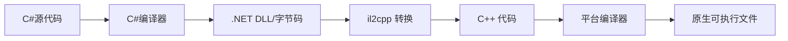

# Unity 术语表

## il2cpp

`il2cpp(Intermediate Language)` 是 Unity 引擎的一个重要部分，它负责将 C#/.NET 代码转换为 C++，然后再编译为原生平台代码。

**一、il2cpp 是什么？**

**il2cpp** 是 Unity 的 Ahead-of-Time (AOT) 编译系统，它包含两个主要部分：

1. **AOT 编译器**：将 .NET 字节码转换为 C++ 代码。

   [^.NET字节码]: 指的是 **CIL（Common Intermediate Language，公共中间语言）**，有时也被称为 **MSIL（Microsoft Intermediate Language）**。这是一种由.NET编译器生成的中间代码。

2. **运行时库**：替代了部分 .NET Framework/Mono 功能，提供垃圾回收、线程管理等。

**二、工作原理流程**



**三、为什么要用 il2cpp？**

**主要优势：**

1. **性能提升**
   - C++ 代码可以更好地被各个平台的编译器优化
   - 避免了 JIT 编译的开销
   - 更好的缓存局部性
2. **安全性增强**
   - 代码更难被反编译和修改
   - 保护知识产权
3. **跨平台一致性**
   - 在支持 AOT 的平台上提供一致的执行环境
   - 解决 iOS 等平台的 JIT 限制
4. **内存使用优化**
   - 可以更好地控制内存布局
   - 减少元数据开销

**四、启用 il2cpp**

不需要代码更改，只需在 **Player Settings** 中设置 **Scripting Backend** → **IL2CPP**。

**五、il2cpp 的局限性**

   **不支持的功能：**

```c#
// 1. 动态代码生成（部分受限）
// System.Reflection.Emit 不可用
var method = new DynamicMethod(...); // 运行时错误

// 2. 完整的反射功能受限
typeof(MyClass).GetMethod("PrivateMethod"); // 可能需要额外配置

// 3. 某些序列化方式可能受影响
BinaryFormatter formatter = new BinaryFormatter(); // 小心使用
```

**六、性能优化技巧**

1. 减少反射使用，土建使用委托或者接口。

2. 优化泛型，避免过多值类型泛型实例化。

3. 字符串处理，使用StringBuilder。

4. 配置连接器。

   ```xml
   <!-- link.xml 文件保留特定类型 -->
   <linker>
     <assembly fullname="MyAssembly">
       <type fullname="MyClass" preserve="all"/>
       <namespace fullname="MyNamespace" preserve="all"/>
     </assembly>
   </linker>
   ```

**七、调试 il2cpp**

- Unity Profiler
- Android Profiler (Android Studio)
- Instruments (iOS)
- Windows Performance Analyzer

**八、常见问题解决**

1. 链接器剥离过多代码

   ```
   // 错误：MethodNotFoundException
   // 解决方案：使用 [Preserve] 属性
   [System.Runtime.CompilerServices.Preserve]
   public class MyClass { }
   ```

2. 平台相关代码

   ```c#
   #if UNITY_IOS && !UNITY_EDITOR
       // iOS 特定代码
   #elif UNITY_ANDROID && !UNITY_EDITOR
       // Android 特定代码
   #endif
   ```

3. 大小优化

   ```c#
   // 使用 Code Stripping
   // Player Settings → Stripping Level:
   // - Disabled
   // - Strip Assemblies (推荐)
   // - Strip ByteCode (高级)
   ```


## **CLR**

**CLR（Common Language Runtime，公共语言运行时）** 是 **.NET Framework** 和 **.NET Core/.NET 5+** 的核心执行引擎，负责管理 .NET 应用程序的运行时环境。它相当于 Java 的 JVM（Java 虚拟机），但设计理念和实现有所不同。

**主要组件：**

```
 1. Class Loader      (类加载器)
 2. JIT Compiler      (即时编译器)
 3. Garbage Collector (垃圾回收器)
 4. Security Engine   (安全引擎)
 5. Thread Manager    (线程管理器)
 6. Type Checker      (类型检查器)
 7. Exception Manager (异常管理器)
```

**执行流程**

**从源代码到执行：**

```
1. 源代码编译
   C#代码 → 编译器(csc) → IL代码 + 元数据 (.dll/.exe)

2. 加载阶段
   ↓
   CLR加载程序集 → 验证IL → 分配内存

3. JIT编译阶段
   ↓
   IL代码 → JIT编译器 → 本机机器码
   (方法首次调用时编译，结果缓存供后续使用,JIT缓存是进程级别的，不是永久性的)

4. 执行阶段
   ↓
   执行本机代码 → GC管理内存 → 异常处理
```


**实际应用示例**

**查看 CLR 信息：**

```c#
// 获取当前 CLR 版本
Console.WriteLine($"CLR 版本: {Environment.Version}");
Console.WriteLine($"运行时: {RuntimeInformation.FrameworkDescription}");

// 检查是否在特定 CLR 中运行
bool isNetFramework = RuntimeInformation.FrameworkDescription.Contains(".NET Framework");
bool isNetCore = RuntimeInformation.FrameworkDescription.Contains(".NET Core");
```

**性能诊断：**

```c#
// 监控 GC
long memoryBefore = GC.GetTotalMemory(false);
// 执行操作...
long memoryAfter = GC.GetTotalMemory(false);
Console.WriteLine($"内存使用: {memoryAfter - memoryBefore} bytes");

// 获取 GC 统计信息
Console.WriteLine($"GC 集合次数: Gen0={GC.CollectionCount(0)}, Gen1={GC.CollectionCount(1)}, Gen2={GC.CollectionCount(2)}");
```


## assembly

**程序集（Assembly）** 是 .NET 应用程序的**基本部署和版本控制单元**，它是一个包含编译后的代码、元数据和资源的逻辑容器。在物理上，程序集可以是 **.exe**（可执行文件）或 **.dll**（动态链接库）。

**Unity 中的程序集**

**Unity 的项目结构：**

```
项目结构示例：
Assets/
├── Scripts/
│   ├── Player.cs
│   └── Enemy.cs
├── Plugins/
│   └── ThirdParty.dll
└── Editor/
    └── CustomEditor.cs

编译后生成：
Library/ScriptAssemblies/
├── Assembly-CSharp.dll                    # 主程序集
├── Assembly-CSharp-firstpass.dll         # 预编译程序集
├── Assembly-CSharp-Editor.dll            # 编辑器程序集
├── UnityEngine.dll                       # Unity 引擎核心
└── Unity.*.dll                           # 各模块程序集
```

**Unity 程序集的最佳实践**

**案例 1：模块化游戏架构**

```
// 项目结构：
Assets/
├── Core/
│   └── Core.asmdef                    # 基础工具、扩展方法
├── Data/
│   └── Data.asmdef → Core            # 数据模型、配置
├── Gameplay/
│   └── Gameplay.asmdef → Core, Data  # 游戏逻辑
├── UI/
│   └── UI.asmdef → Core, Gameplay    # 用户界面
└── Editor/
    ├── Core.Editor.asmdef → Core     # 核心编辑器工具
    └── Gameplay.Editor.asmdef → Gameplay, Core.Editor
```