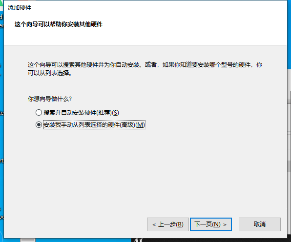
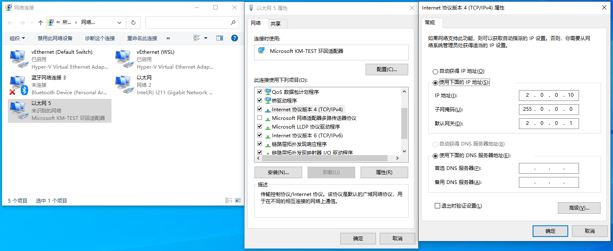
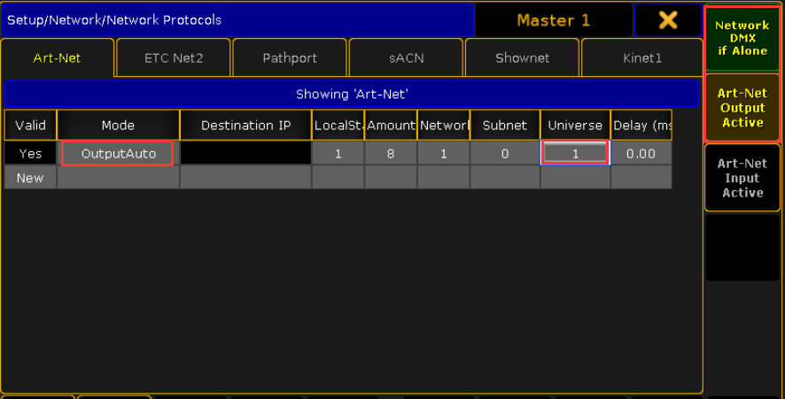
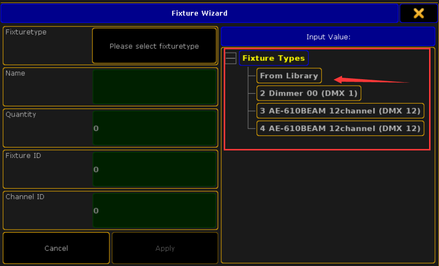
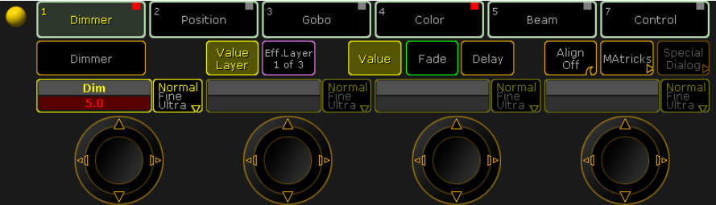

[TOC]

# 虚幻引擎DMX视效预览

> GDTF 灯具文件下载 https://gdtf-share.com/ 
>
> acme品牌灯具下载 https://www.acme.com.cn/Info/dengkudetail/cat_id/61

## 环境配置

首先关闭Windows系统防火墙。

因为MA2 中 ArtNet协议 只支持2网段或者5网段，所以我们添加一个环回适配器，将其IP改为需要的网段，也不影响机器自身的使用。

1. **WIN+R**输入 **hdwwiz**
   
2. **添加硬件** 窗口点击下一步。
3. 选择 **安装我手动从列表选择的硬件(高级)(M)**，下一步。
   
4. **常见硬件类型**选择**网络适配器**下一步。
   
5. **厂商**选择**Microsoft**，**型号**选择**Microsoft KM-TEST环回适配器**，下一步直至完成。
   
   
6. 网络适配器中找到刚才配置的环回适配器，修改为固定IP**2.0.0.10**，子掩码 **255.0.0.0**，默认网关**2.0.0.1**（**特别注意,默认网关是否正确**.）
   
7. 如果需要删除多余环回适配器，在**设备管理器**中找到**网络适配器**选中要删除的适配器右键**卸载**即可.
   

## 软件安装

| 软件                                                         | 版本     | 备注                                                         |
| ------------------------------------------------------------ | -------- | ------------------------------------------------------------ |
| 虚幻引擎                                                     | 4.27     | 针对4.27的版本设置                                           |
| [grandMA2 onPC](Software\gMA2\3.1.2.5\gMA2onPC_v3.1.2.5.exe) | 3.1.2.5  | 必须为3.1.2.5,只有该版本开放了ArtNet协议。 如果有灯光控制台则无视版本限制。 |
| [MA 3D](Software\gMA2\3.1.2.5\MA3D_v3.1.2.5.exe)             | v3.1.2.5 | 与ma2软件匹配的3d预览软件                                    |

## 虚幻引擎

### 启用插件

- DMX Engine
- DMX Fixtures
- DMX Protocol

### 插件设置

1. **Project Settings**-->**Plugins**-->**DMX Plugins**

2. **Input Ports** Add Element。

   | 属性                              | 值       | 描述                 |
   | --------------------------------- | -------- | -------------------- |
   | Port Name                         | InTest   | 自定义协议名称       |
   | Protocol Name                     | Art-Net  | 选择通信类型         |
   | Network Interface Card IP Address | 2.0.0.10 | 选中环回适配网络的IP |
   | Local Universe Start              | 1        |                      |
   | Amount of Universes               | 10       |                      |
   | Extern Universe Start             | 1        |                      |
   |                                   |          |                      |

3. Out Ports 暂时没有使用虚幻引擎输出DMX，无需配置。

### DMX Library

1. 导入.gdtf灯具配置文件。

2. Add/Import ->DMX-->DMXLibrary

3. 打开创建的DMXLibrary文件，**LibrarySetting**页签选项显示如下：
   

4. **FixtureType** 页签，**NewFixtureType** 创建灯具类型，并重命名。

5. 选中上一步创建的灯具类型，下方 **FixtureSettings** 属性分类中 https://gdtf-share.com/选中导入的灯具配置文件。此时会自动生成Modes 和 Function。
   

6. **Fixture Patch** 灯具配接页签 Add Fixtures，下拉框选择前边创建的灯具。

7. **DMXFixtures Content** ->**LightFixtures** 选择一个灯具复制到项目或者创建自蓝图并吧子蓝图移动到项目。切忌不可修改引擎中的灯具文件。

8. 打开刚才新建的灯具，**Components** 选中**DMX**， Properties -->**DMXLibrary** 选择前边创建好的**DMXLibrary**文件，**Fixture Patch** 选择前边创建好的灯具配接信息。
   

### 测试

1. DMX Tools -->Open Output Console。
2. 配置Output Console 中 Faders(推子) ,推子地址要与DMXLibrary文件TixtureType地址相匹配。
   
3. Affected Faders 选择ALl，点击 Sine Wave，推子数值开始不断变化。
   
4. DMX Tools -->Open Channel Monitor，可看到数值的变化。
   
5. 灯具蓝图放置到场景中 Play，可看到灯具属性变化效果。
6. 测试完成后关闭 **DMX Output Console**  窗口。 

## MA2(MA_grandMA2)

安装[grandMA2 onPC](Software\gMA2\3.1.2.5\gMA2onPC_v3.1.2.5.exe)，无特殊设置。

### 设置MA2软件网络

打开软件后点击 **Setup**。
		

1. **Network**

   1. **Network** -->**MA Network Control**
   2. Station IP :2.0.0.10。
   3. 保存退出,重新启动MA2。每次修改IP后都需要重新启动MA2软件。
   4. 启动软件后回到此处，**Create Session**。
      
2. **MA Network Configuration**

   **如果有灯光控制台可以忽略此步骤**

   1. 切到**Consoles**页签点击 **Add**。
   2. IP ETHERCON1 (ETHO) 输入 **2.0.0.10**。
   3. 看到Name 下 红色 **Console** 背景 变成绿色，在1~2秒后变为红色即成功。
      
3. **Network Protocols**
   1. Art-Net 页签 点击**ADD**。
   2. **Mode**更改为**OutputAuto**
   3. **Universe**该为1，与虚幻引擎中相匹配。
   4. 其他属性根据需求调整。
   5. 右侧点击 **Network DMX if Alone**  和 Art-Net Output Active，使其处于选中状态。
      

### 创建灯具

1. 点击Setup。
   

2. **Show**-->**Patch & Fixture Schedule**

3. **Add Layer** 输入Layer Name。
   

4. **Fixture Wizard** 窗口 **Fixture Types** -->**From Library**。
   

5. Import Fixture Type 窗口 找到需要的灯具，点击**Import**。

   - **Manufacturer**(生产商)
   - **Fixture**(灯具型号)

   

6. 根据需求填写参数，测试流程只添加一盏灯，**Apply**后退出**Setup**界面。
   

7. 点击**Clear**清空命令行信息。按顺序点击**Fixture**和**Please**，命令行切换至 [Fixture]。
   

8. 按顺序点击数字区 **1** **Thru** **Please**。
   

9. 点击**Full** 亮灯。
   

10. 回到之前配置好的虚幻引擎工程，Play，应该已经可以收到数据。尝试调整灯光属性看看虚幻引擎中灯光的变化。
    

### 常见问题

- 检查环回适配器IP要设置成**2**网段或者**5**网段。
- **MA Network Control** 检查IP设置。切换IP后必须重新启动MA2软件。
- **MA Network Control** **Session**是否创建。
- 每次启动MA2，**MA Network Configuration** -->**Consoles** 中添加的Item需要更新一下。确保看到 Console 变绿1~2秒又变黄这个过程。
- **Network Protocols** -->**Art-Net** Item [**Mode** :OutputAuto]，[**Universe**:1]
- 灯光是否点亮 **Full**

## MA 3D

安装后打开MA3D，同时打开MA2。

1. **File**-->**Settings**-->**Network** 设置IP Address **2.0.0.10**。

2. Sessions 窗口看到  一条Session。并记下**User**名称
   
   
3. **MA2**软件中**MA Network Configuration**选中**3D**页签，点击AddPresent，添加项，并修改属性。
   
   1. Session Member 设置为 Yes。
   
   2. User设置为 MA3D 中的User。Item 背景变绿后链接成功。
      
   
   3. 返回MA3D，可看到灯光已经出现在舞台中。在MA2中调整灯光信息即可看到变化。链接状态的裂开的红心变为绿色的心。
   
      

